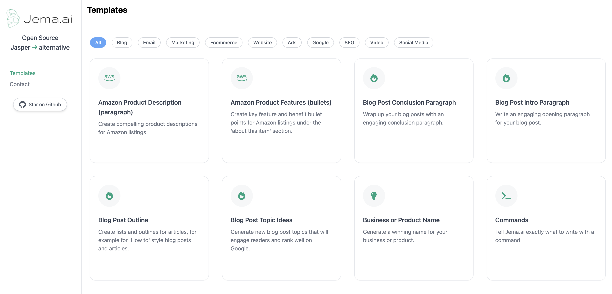

<p align="center">
  <a href="https://jema.ai">
    
  </a>
</p>

<h1 align="center">Welcome to Jema.ai</h1>
<h2 align="center">Open source Jasper alternative.</h2>
<p align="center">
  <a href="https://opensource.org/licenses/MIT" target="_blank">
    
  </a>
</p>


This project uses ChatGPT API to create almost any text based output for your need - from marketing content
to blog post ideas and a lot more. It uses simple template based components to ask ChatGPT for generating results
Creating new templates or tasks take about 30 mins. no more, so you can extend it for your needs or wait for new
template release :)

[](https://jema.ai)

# [Jema.ai](https://jema.ai) Open Source Jasper alternative

## How it works

This project uses the [ChatGPT API](https://openai.com/api/)
and [Vercel Edge functions](https://vercel.com/features/edge-functions).
It takes a template for each action or command type, and based on the inputs and mission, it sends ChatGPT the commands
to get the required results.
The "command" field in each template is most important to tell ChatGPT what to do. In addition, you can add different
input types for each template if you wish to use additional parameters.
More template can be added to the `TEMPLATES` list.

## Add your own OpenAI API key and have your own Jema.ai

In order to work locally or deploy this project to Vercel, you need to set your OPENAI_API_KEY to use ChatGPT3 API.
Once added , this should work out of the box.

## Running Locally

This project is built with `Next.js` and `TailwindCSS`, so you can deploy it directly to Vercel.

After cloning the repo, go to [OpenAI](https://beta.openai.com/account/api-keys) to make an account and put your API key
in a file called `.env.local`(OPENAI_API_KEY)
Then, run the application in the command line and it will be available at `http://localhost:3000`.

```bash
npm install

yarn dev
```

## Changing ChatGPT prompts and requests

You can fine tune ChatGPT to your needs, give it any mission that you wish it to complete.
The basic message structure is as follows:

```javascript

const generateOutputHandler = async (template: Template, inputsData: { [key: string]: string }) => {
    const instruction = createInstruction(template.inputs, inputsData);
    const mainGoal = template.description;

    const messages = [
        { role: "system", content: "You are a helpful assistant." },
        { role: "user", content: `Your task is: "${mainGoal}".\n\nHere are the details:\n${instruction}. 
            Please suggest 3 outputs. number them 1,2,3` },
    ];

    try {
        const response: any = await openai.createChatCompletion({
            model: "gpt-3.5-turbo",
            // @ts-ignore
            messages: messages,
            temperature: 1,
        });

        const reply = response?.data?.choices[0].message.content;
        setOutput(reply || '');

    } catch (error) {
        console.log(error)
    }
};
```

## Who made this project

My name is [Yuval](https://www.linkedin.com/in/yuval-suede/) - an entrepreneur at heart , I ❤️ building end-to-end
systems that not only look amazing and feel state-of-the-art, but also have real meaning and impact.

You can contact me on Linkedin for any suggestions, questions or thoughts. 
https://www.linkedin.com/in/yuval-suede/

## 🤝 Contributing

Contributions, issues and feature requests are welcome!<br /> 
I will always appreciate a STAR and an attribution of the main demo [website](https://jema.ai)

* Fork the repository, Clone it on your device. That's it 🎉
* Finally make a pull request :)

## 📝 License

This project is [MIT License](https://opensource.org/licenses/MIT) licensed.

